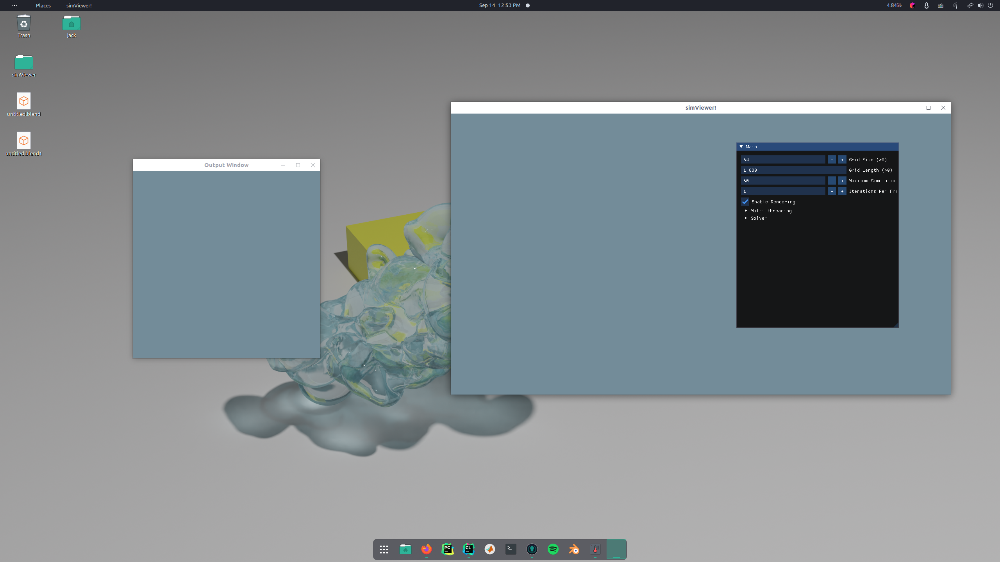

# simViewer
Simulation Viewer for my Master's Research

<p float="center">
  
  
  
</p>

The application is a GUI application that allows users to experiment on the fly with different fluid simulation 
parameters. Two methods are currently implemented, Jos Stam's Stable Fluids [1] and a generic Lattice Boltzmann 
Method [2]. It supports 2D simulation and visualization of fluid 
flow and 3D simulation without visualization of fluid flow for the NS solver. It supports 2D simulation and visualization of 
fluid flow and density for the Lattice Boltzmann solver. The Lattice Boltzmann Method is implemented in CUDA so a 
CUDA capable GPU is required to run the software.

Simulation data can be cached in .PNG format for 2D data and .vdb for 3D data. The .vdb data can be imported into an 
application like Blender for rendering.

## Dependencies
Most dependencies are included in the repo but a few need to be installed by the user separately

- [OpenVDB](https://github.com/AcademySoftwareFoundation/openvdb): follow the build and install instructions
- [CUDA 11+](https://developer.nvidia.com/cuda-downloads)
- [vcpkg](https://github.com/microsoft/vcpkg) Windows Only
- [GLFW3](https://www.glfw.org/) recommended installing using vcpkg on Windows
- [CMake 3.19+](https://cmake.org/)

## Building

### Unix-like

```
git clone --recursive https://github.com/jackm97/simViewer.git
cd simViewer
mkdir build
cd build
cmake ..
make -j 
```

### Windows

```
git clone --recursive https://github.com/jackm97/simViewer.git
cd simViewer
mkdir build
cd build
cmake -DCMAKE_TOOLCHAIN_FILE=<PATH_TO_VCPKG>\scripts\buildsystems\vcpkg.cmake -DVCPKG_TARGET_TRIPLET=x64-windows -A x64 ..
cmake --build . --parallel 4 --config Release
```

## Running the Application
Once built, the executable will be stored in ```simViewer/build/bin```. Following the build step run:
```
cd bin
./simViewer
```

If all goes well you should see the following


